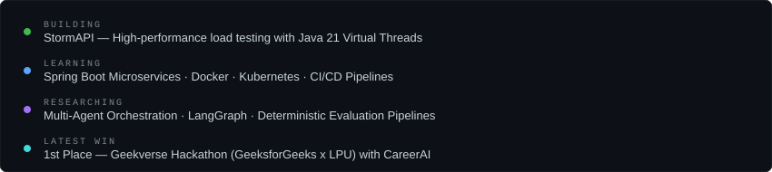

<!--
  LOVEJEET SINGH — GitHub Profile
  Setup: Copy README.md + assets/ folder + .github/workflows/snake.yml
  into the z-lovejeet/z-lovejeet repository.
-->

<!-- ═══════════════════════════ HEADER ═══════════════════════════ -->

  

  
  &emsp;
  
  &emsp;
  
  &emsp;
  

 

 

<!-- ═══════════════════════════ ABOUT ═══════════════════════════ -->

  

 

 

<!-- ═══════════════════════════ STATUS ═══════════════════════════ -->

  

 

 

<!-- ═══════════════════════════ ANALYTICS ═══════════════════════════ -->

&nbsp;

  

 

 

<!-- ═══════════════════════════ TECH STACK ═══════════════════════════ -->

  

 

 

<!-- ═══════════════════════════ PROJECTS ═══════════════════════════ -->

<table>
<tr>

<td width="50%" valign="top">

**StormAPI**
 
High-performance API load testing engine

`Java 21` `Spring Boot` `PostgreSQL` `WebSocket` `React`

Virtual Threads concurrency · Real-time STOMP telemetry · Binary search breakpoint detection · HdrHistogram p99 metrics

</td>

<td width="50%" valign="top">

**CareerAI** · *Winner*
 
7-agent agentic AI placement system

`Next.js` `Gemini API` `Supabase` `TypeScript`

Custom orchestrator (40% faster TTFT) · 3-tier model fallback · Proactive Alert Engine · Gamification engine

</td>

</tr>
<tr>

<td width="50%" valign="top">

**Lumos**
 
AI-powered academic operating system

`Next.js` `LangGraph` `Supabase` `Prisma`

5-tier AI architecture · Browser ML via WASM · LLM router with cloud fallback · ROI-ranked study strategies

</td>

<td width="50%" valign="top">

**[Pathfinding Visualizer](https://pathfinding-visualizer-flax-one.vercel.app/)**
 
Interactive 3D algorithm explorer

`Next.js` `Three.js` `React Three Fiber` `Zustand`

6 algorithms · 5 maze generators · 3D WebGL board · Comparison mode · Share links via Neon PostgreSQL

</td>

</tr>
<tr>

<td width="50%" valign="top">

**Bengaluru Price Predictor**
 
End-to-end ML pipeline + full-stack app

`Python` `FastAPI` `scikit-learn` `PyTorch`

178 locations · 9,200+ listings · 7-phase ML pipeline · Neural network with AdamW · Explainable AI panel

</td>

<td width="50%" valign="top">

**Wealify Labs**
 
Premium course platform — built from scratch

`Next.js` `Supabase` `PayPal SDK` `Crypto Payments`

Server-first SSR · Cookie-based auth + RLS · Dual payment gateways · Admin analytics dashboard

</td>

</tr>
</table>

 

 

<!-- ═══════════════════════════ ACTIVITY ═══════════════════════════ -->

 

<picture>
  <source media="(prefers-color-scheme: dark)" srcset="https://raw.githubusercontent.com/z-lovejeet/z-lovejeet/output/github-contribution-grid-snake-dark.svg" />
  <source media="(prefers-color-scheme: light)" srcset="https://raw.githubusercontent.com/z-lovejeet/z-lovejeet/output/github-contribution-grid-snake.svg" />
  
</picture>

 

<!-- ═══════════════════════════ FOOTER ═══════════════════════════ -->

  

